# Übungsbeispiele und Lösungen

## SPARQL

> *Selektiere den Publisher, Author und Buchtitel derjenigen Elemente, welche "Semantic Web" im Titel haben*

```sql
PREFIX dc:<http://purl.org/dc/elements/1.1
SELECT ?publisher ?author ?title WHERE {
  ?book dc:publisher ?publisher .
  ?book dc:title ?title .
  ?book dc:author ?author .
  FILTER(REGEX(?title, "Semantic Web"))
}

```

> *Selektiere den Publisher, Author und Buchtitel derjenigen Elemente, welche nach dem Jahr 2012 veröffentlicht wurden*

```sql
PREFIX dc:<http://purl.org/dc/elements/1.1
PREFIX xsd:<http://www.w3.org/2001/XMLSchema#> 

SELECT ?publisher ?author ?title WHERE {
  ?book dc:publisher ?publisher .
  ?book dc:title ?title .
  ?book dc:author ?author .
  ?book dc:date ?date .
  FILTER(?date >= '2013-01-01'^^xsd:date)
}

```


> *Selektiere alle Personen welche bei IBM arbeiten, jedoch nicht die FHGR besucht haben*

```sql
PREFIX foat:<http://xmlns.com/foaf/0.1

SELECT ?person ?name WHERE {
  ?person foaf:name ?name .
  ?person foaf:workplaceHomepage ?work .
  OPTIONAL {
    ?person foaf:schoolHomepage ?atFHGR .
    FILTER(?atFHGR = "http://www.fhgr.ch")
  }
  FILTER(?work = "http://ibm.com" && !bound(?atFHGR)) } 
```

## Aufgabenblatt 01

### Metadaten
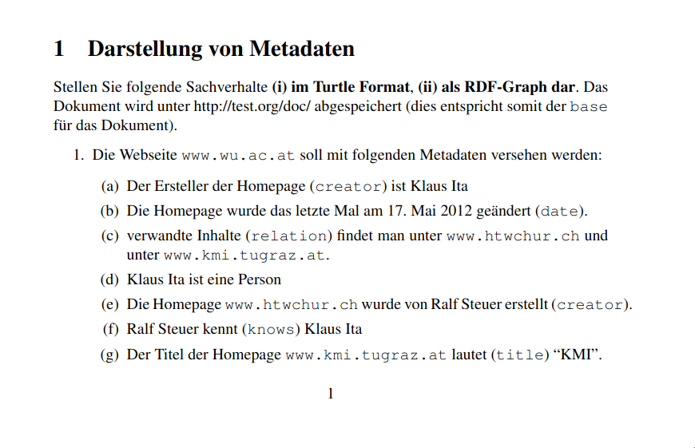

<details>
  <summary><b>Lösung</b></summary>

  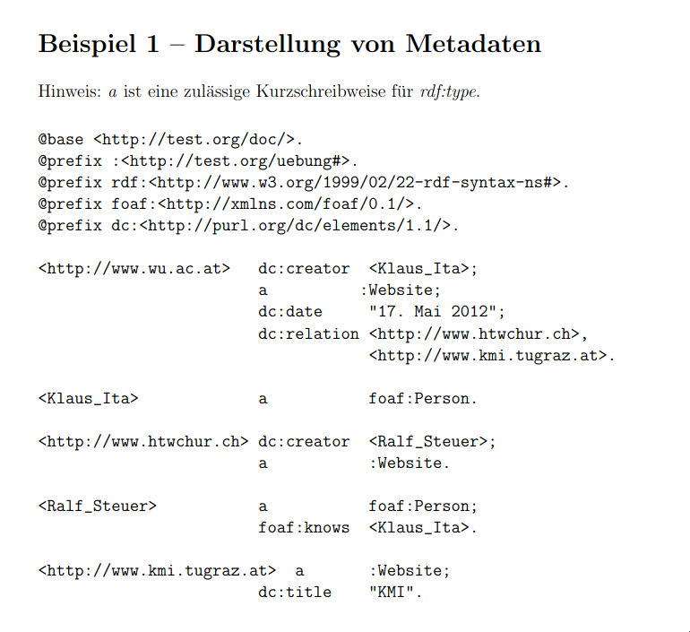
</details>

### Anonyme Ressource
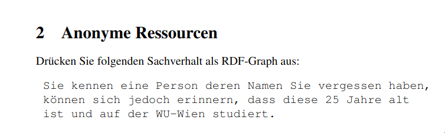

<details>
  <summary><b>Lösung</b></summary>

  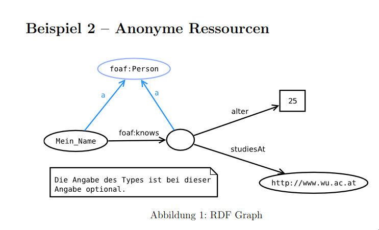
</details>

### Annotationen
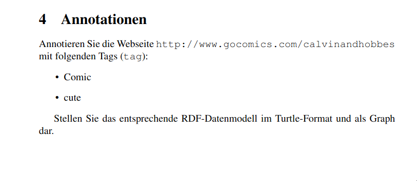

<details>
  <summary><b>Lösung</b></summary>

  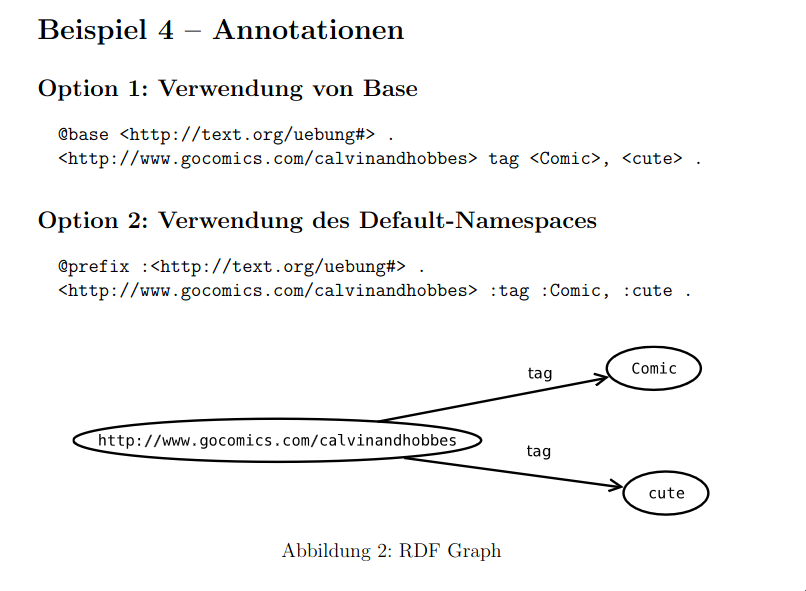
</details>


### Reification
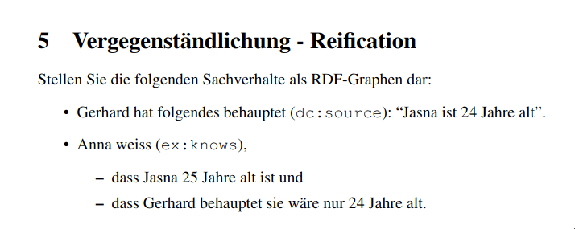

<details>
  <summary><b>Lösung</b></summary>

  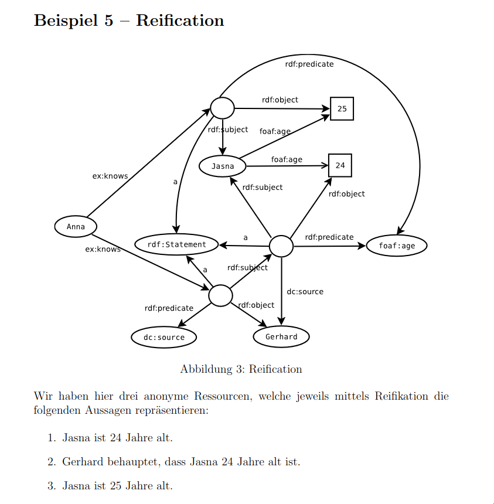
</details>

### Serialisierungsformate
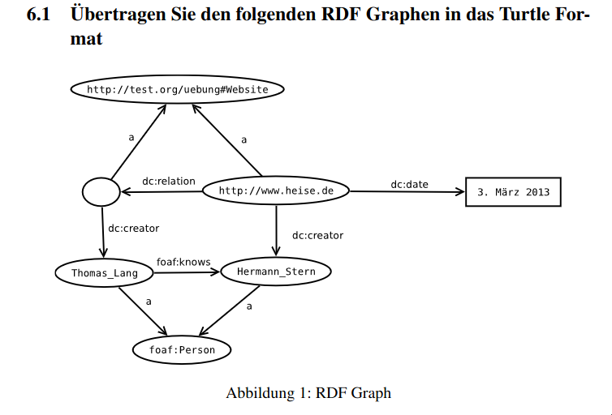

<details>
  <summary><b>Lösung</b></summary>

  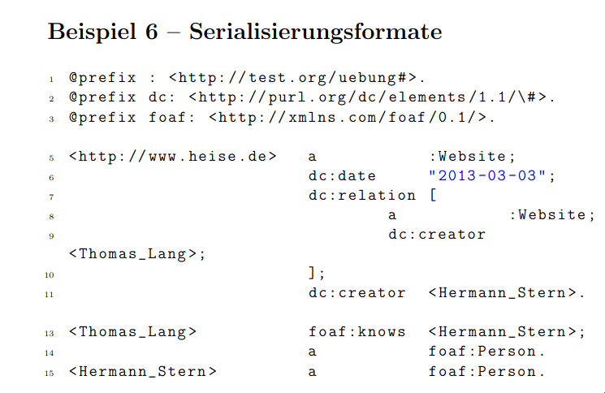
</details>

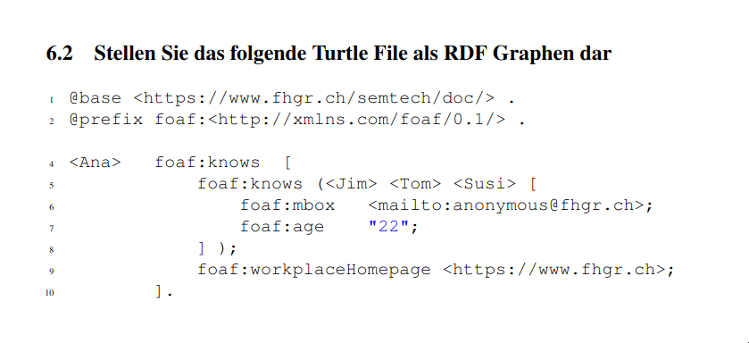

<details>
  <summary><b>Lösung</b></summary>

  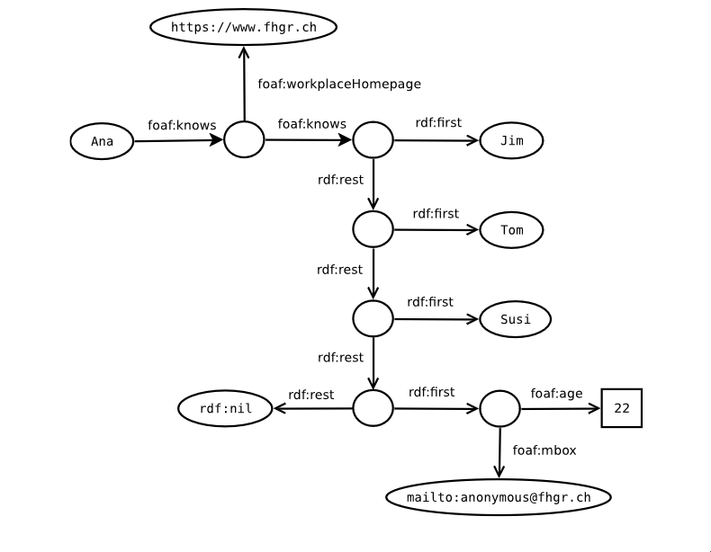
</details>

## Aufgabenblatt 02

### FOAF
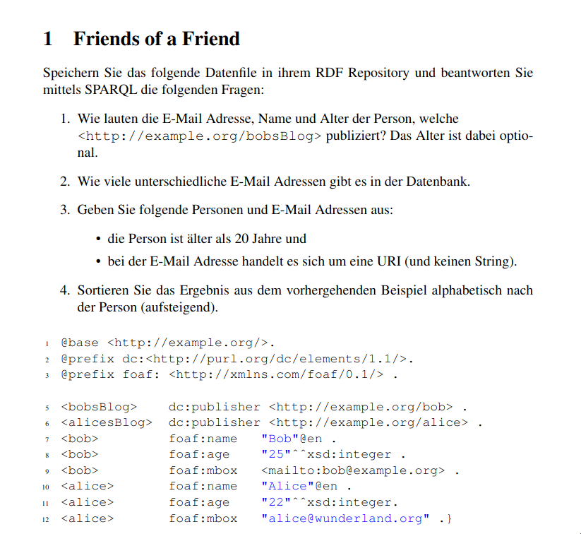

<details>
  <summary><b>Lösung</b></summary>

  > Wie lauten die E-Mail Adressen, Name und Alter der Person, welche `bobsBlog` publizierten? Das Alter ist dabei `optional`
  ```sql
  PREFIX dc: <http://purl.org/dc/elements/1.1/>
  PREFIX foaf: <http://xmlns.com/foaf/0.1/>
  prefix rdfs: <http://www.w3.org/2000/01/rdf-schema#>
  prefix owl: <http://www.w3.org/2002/07/owl#>

  SELECT ?publisher ?mail ?name ?age
  WHERE {
    <http://example.org/bobsBlog> dc:publisher ?publisher.
    ?publisher foaf:mbox ?mail.
    ?publisher foaf:name ?name.
    OPTIONAL { ?publisher foaf:age ?age. }
  }
  LIMIT 25
  ```

  > Wie viele unterschiedliche E-Mail Adressen gibt es in der Datenbank?
  ```sql
  PREFIX dc: <http://purl.org/dc/elements/1.1/>
  PREFIX foaf: <http://xmlns.com/foaf/0.1/>
  prefix rdfs: <http://www.w3.org/2000/01/rdf-schema#>
  prefix owl: <http://www.w3.org/2002/07/owl#>

  SELECT DISTINCT ?mail
  WHERE {
    ?publisher foaf:mbox ?mail.
  }
  LIMIT 25
  ```
  > Geben sie alle Personen aus, welche älter als 20 Jahre sind und bei denen die E-Mail Adresse eine URI ist
  ```sql
  PREFIX dc: <http://purl.org/dc/elements/1.1/>
  PREFIX foaf: <http://xmlns.com/foaf/0.1/>
  prefix rdfs: <http://www.w3.org/2000/01/rdf-schema#>
  prefix owl: <http://www.w3.org/2002/07/owl#>

  SELECT DISTINCT ?person ?mail
  WHERE {
    ?person foaf:name ?name.
    ?person foaf:mbox ?mail.
    ?person foaf:age ?age.
    FILTER(?age >= 20 && isURI(?mail))
  }
  LIMIT 25
  ```
</details>

### Sonne, Mond und Sterne
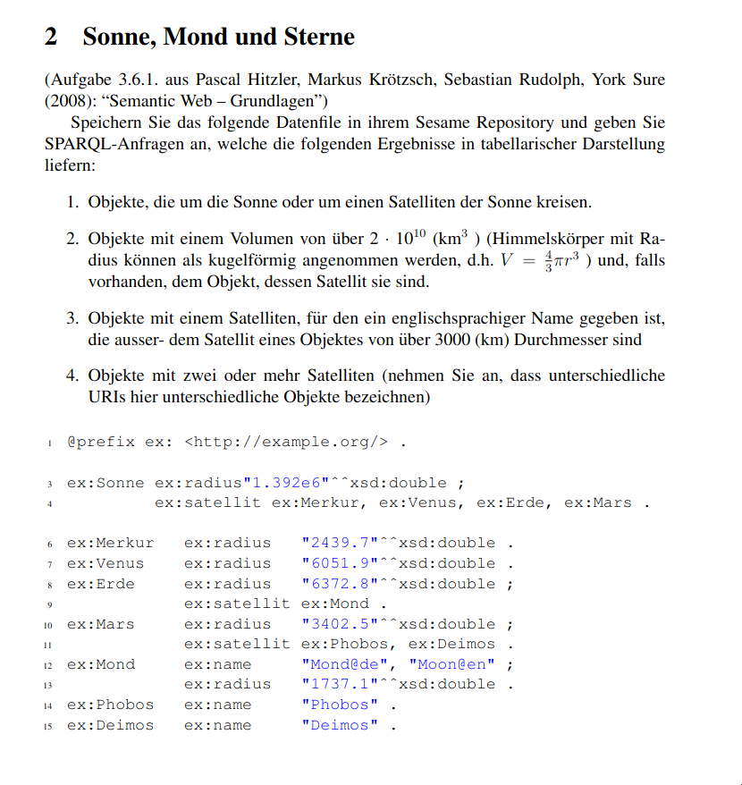

<details>
  <summary><b>Lösung</b></summary>

  > Objekte die um die Sonne oder um einen Satelliten der Sonne kreisen

  ```sql
  PREFIX dc: <http://purl.org/dc/elements/1.1/>
  PREFIX foaf: <http://xmlns.com/foaf/0.1/>
  PREFIX ex: <http://example.org/>
  prefix rdfs: <http://www.w3.org/2000/01/rdf-schema#>
  prefix owl: <http://www.w3.org/2002/07/owl#>

  SELECT ?objekt
  WHERE {
    ?s ex:satellit ?objekt.
  }
  LIMIT 25
  ```

  > Alle Objekte welche ein Volumen von mehr als 2 x 10^10 Kubikkilometer besitzen und falls vorhanden der dazugehörige Satellit

  ```sql
  PREFIX dc: <http://purl.org/dc/elements/1.1/>
  PREFIX foaf: <http://xmlns.com/foaf/0.1/>
  PREFIX ex: <http://example.org/>
  prefix rdfs: <http://www.w3.org/2000/01/rdf-schema#>
  prefix owl: <http://www.w3.org/2002/07/owl#>
  prefix ofn: <http://www.ontotext.com/sparql/functions/>

  SELECT ?objekt ?objektvon
  WHERE {
    ?objekt ex:radius ?radius.
    FILTER(?radius > 3*2*10/(4*3.14159265359))
    ?objektvon ex:satellit ?objekt.
  }
  LIMIT 25
  ```

  > Objekte mit einem Satelliten, für den ein englischsprachiger Name gegeben ist, die ausser- dem Satellit eines Objektes von über 3000 (km) Durchmesser sind

  ```sql
  PREFIX dc: <http://purl.org/dc/elements/1.1/>
  PREFIX foaf: <http://xmlns.com/foaf/0.1/>
  PREFIX ex: <http://example.org/>
  prefix rdfs: <http://www.w3.org/2000/01/rdf-schema#>
  prefix owl: <http://www.w3.org/2002/07/owl#>
  prefix ofn: <http://www.ontotext.com/sparql/functions/>

  SELECT ?objekt ?satelit
  WHERE {
    ?objekt ex:satellit ?satelit.
    ?satelit ex:name ?name.
    ?objekt ex:radius ?radius.
    FILTER(?radius *2 > 3000 &&
    lang(?name)='en')
  }
  LIMIT 25
  ```

  > Objekte mit zwei oder mehr Satelliten (nehmen Sie an, dass unterschiedliche URIs hier unterschiedliche Objekte bezeichnen)

  ```sql
  PREFIX dc: <http://purl.org/dc/elements/1.1/>
  PREFIX foaf: <http://xmlns.com/foaf/0.1/>
  PREFIX ex: <http://example.org/>
  prefix rdfs: <http://www.w3.org/2000/01/rdf-schema#>
  prefix owl: <http://www.w3.org/2002/07/owl#>
  prefix ofn: <http://www.ontotext.com/sparql/functions/>

  SELECT ?object (COUNT(?satellite) AS ?satelliteCount)
  WHERE {
    ?object ex:satellit ?satellite .
  }
  GROUP BY ?object
  HAVING (COUNT (?satellite) >= 2)
  ```
</details>

### Cafe

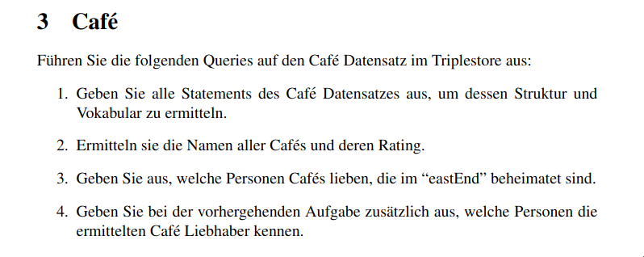

<details>
  <summary><b>Lösung</b></summary>

  > Geben Sie alle Statements des Café Datensatzes aus, um dessen Struktur und Vokabular zu ermitteln.

  ```sql
  PREFIX rdfs: <http://www.w3.org/2000/01/rdf-schema#>
  PREFIX owl: <http://www.w3.org/2002/07/owl#>
  SELECT ?subject ?predicate ?object
  WHERE {
    ?subject ?predicate ?object
  }
  ```

  > Ermitteln sie die Namen aller Caf´es und deren Rating.

  ```sql
  PREFIX dc: <http://purl.org/dc/elements/1.1/>
  PREFIX rdfs: <http://www.w3.org/2000/01/rdf-schema#>
  PREFIX owl: <http://www.w3.org/2002/07/owl#>
  PREFIX default: <http://inf.ed.ac.uk/examples#>

  SELECT ?title ?rating
  WHERE {
    ?subject dc:title ?title.
    ?subject default:rating ?rating.
  }
  LIMIT 25
  ```

  > Geben Sie aus, welche Personen Café's lieben, die im "eastEnd" beheimatet sind.

  ```sql
  PREFIX foaf: <http://xmlns.com/foaf/0.1/>
  PREFIX rdfs: <http://www.w3.org/2000/01/rdf-schema#>
  PREFIX owl: <http://www.w3.org/2002/07/owl#>
  PREFIX default: <http://inf.ed.ac.uk/examples#>

  SELECT ?person ?name
  WHERE {
    ?subject <http://dbpedia.org/property/locatedIn> ?location.
    FILTER (?location = default:eastEnd)
    ?subject default:lovedBy ?person.
    OPTIONAL {?person foaf:name ?name.}
  }
  ```

  > Geben Sie bei der vorhergehenden Aufgabe zusätzlich aus, welche Personen die ermittelten Café Liebhaber kennen.

  ```sql
  PREFIX foaf: <http://xmlns.com/foaf/0.1/>
  PREFIX rdfs: <http://www.w3.org/2000/01/rdf-schema#>
  PREFIX owl: <http://www.w3.org/2002/07/owl#>
  PREFIX default: <http://inf.ed.ac.uk/examples#>

  SELECT ?person ?name ?friend
  WHERE {
    ?subject <http://dbpedia.org/property/locatedIn> ?location.
    FILTER (?location = default:eastEnd)
    ?subject default:lovedBy ?person.
    OPTIONAL {?person foaf:name ?name.}
    OPTIONAL {?person foaf:knows ?friend.}
  }
  ```
</details>

## Ontologien

### Ermitteln Sie die Anzahl an Ländern auf DBpedia

<details>
  <summary><b>Lösung</b></summary>

  ```sql
  SELECT DISTINCT ?country ?name WHERE {
    ?country rdf:type dbo:Place .
    ?country rdfs:label ?name .
    FILTER(lang(?name) = "de")
  }
  ```
</details>

### Alle Schweizer Kantone in der deutschen DBpedia

<details>
  <summary><b>Lösung</b></summary>

  ```sql
  SELECT DISTINCT ?capital {
    ?capital dbo:wikiPageWikiLink dbc:Cantons_of_Switzerland .
  }
  ```
</details>

### Alle Schweizer Kantone in der deutschen DBpedia und die zugehörigen Hauptorte

<details>
  <summary><b>Lösung</b></summary>

  ```sql
  SELECT DISTINCT ?capital ?mainCity ?label WHERE {
    ?capital dbo:wikiPageWikiLink dbc:Cantons_of_Switzerland .
    ?capital dbp:seat ?mainCity .
    ?mainCity rdfs:label ?label .
    FILTER(lang(?label) = "de")
  }
  ```
</details>

### Die Abgeordneten des Schweizer Bundesrats und deren Geburtsort

<details>
  <summary><b>Lösung</b></summary>

  ```sql
  SELECT DISTINCT ?member ?birthPlace WHERE {
    ?member dcterms:subject dbc:Members_of_the_Federal_Council_\(Switzerland\).
    ?member dbo:birthPlace ?birthPlace.
  }
  ```
</details>

### Die Anzahl an Schweizer Abgeordneten per Geburtsort (es sollen nur Orte mit mindestens zwei Abgeordneten berücksichtigt werden)


<details>
  <summary><b>Lösung</b></summary>

  ```sql
  SELECT DISTINCT ?member ?birthPlace (count(?member) AS ?memberCount) WHERE {
    ?member dcterms:subject dbc:Members_of_the_Federal_Council_\(Switzerland\).
    ?member dbo:birthPlace ?birthPlace .
    FILTER(lang(?birthPlaceLabel) = "de")
  }
  GROUP BY ?birthPlace
  HAVING (count(?member) >= 2)
  ```
</details>

## Pizza Ontologie
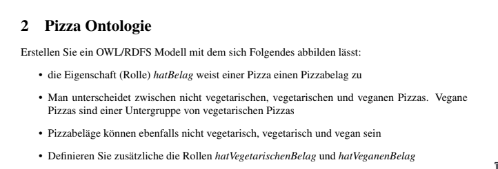

<details>
  <summary><b>Lösung</b></summary>

  ```sql
  @base <http://www.ai.wu.ac.at/.../bibTeX#>.
  @prefix rdf: <http://www.w3.org/1999/02/22-rdf-syntax-ns#> .
  @prefix rdfs: <http://www.w3.org/2000/01/rdf-schema#> .

  <Nicht_vegetarische_Pizza> rdfs:subClassOf <Pizza> .
  <Vegetarische_Pizza> rdfs:subClassOf <Pizza> .
  <Vegane_Pizza> rdfs:subClassOf <Vegetarische_Pizza> .
  <Nicht_vegetarischer_PizzaBelag> rdfs:subClassOf <PizzaBelag> .
  <Vegetarischer_PizzaBelag> rdfs:subClassOf <PizzaBelag> .
  <Veganer_PizzaBelag> rdfs:subClassOf <Vegetarischer_PizzaBelag> .

  aw:hatBelag rdf:type rdf:Property;
              rdfs:domain <Pizza>;
              rdfs:range <PizzaBelag> .

  aw:hatVegetarischenBelag rdf:type rdf:Property;
                           rdfs:domain <Pizza>;
                           rdfs:range <Vegetarischer_PizzaBelag> .

  aw:hatVeganenBelag rdf:type rdf:Property;
                     rdfs:domain <Pizza>;
                     rdfs:range <Veganer_PizzaBelag> .
  ```
</details>