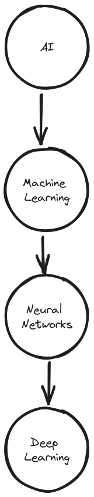

# Einführung und semantische Technologien

## Artificial Intelligence
 

### Programmierung
Zu Beginn war das einfach `Programmieren`. Ein Programmierer schrieb ein Programm, welches mithilfe von Inputdaten (Parameter etc.) einen bestimmten Output (Ergebnis) erzeugte. So wurde für **jede Aufgabenstellung ein bestimmtes Programm** geschrieben.

### Machine Learning
Machine Learning ist der nächste Schritt. Hierzu werden die entsprechenden Parameter (Features) von einer Person extrahiert und anschliessend einem **Modell** zur Verfügung gestellt, welches den gewünschten Output aufgrund von **bestehenden Daten**  vorhersagt.

### Deep Learning
Deep Learning ist die nächste Evolution. Features werden direkt in das Netz gegeben, dieses zieht automatisch die relevanten Features raus und produziert den gewünschten Output. Deshalb ist hier **keine Unterstützung des Menschen notwendig**.

### Anwendungsfelder
* Vorhersage von **chemischen Reaktionen**
* Bildergenerierung von berühmten Personen

### Nachteile 
* Die Modelle beinhalten immer einen gewissen **Bias**
* Das Verhalten ist **stark abhängig vom Trainingsdatensatz** und kann zu ungewünschtem Verhalten führen (ethisch nicht korrekt etc.)
* Bei Bildererkennung kann das verändern eines einzelnen Pixels zu komplett falschen Resultaten führen.

## Semantisches Web
* Entspricht einer **Erweiterung des derzeitigen Webs**
* Strukturiert bestehende Webressourcen, d.h. für Menschen und Maschinen verstehbar

### Syntax vs. Semantik
* Syntax beschreibt die **Struktur der Daten** (XML, RDF)
* Semantik beschreibt die **Bedeutung der Daten** (RDFS, OWL)
* Sind Voraussetzung für **Interoperabilität**, d.h. gemeinsame Syntax (Grammatik) und gemeinsames Verständnis (Ontologie)

### Anwendungsgebiete von semantischen Technologien
* Information Retrieval, d.h. Suchen in unstrukturierten Daten basierend auf Schlüsselwörtern (Google, Page Ranking etc.)
* Semantische Suche - versehen Ressourcen mit semantischen Informationen, dadurch hat die semantische Suche im Gegensatz zur heuristischen/statischen Suche ein bestehendes Hintergrundwissen

### Anwendungsgebiete von semantischen Technologien
* **Verbesserter Datenaustausch** mithilfe von Microformats und RDFa
* Erlaubt Kombination von komplexen Datenquellen durch Linked Open Data und öffentlich zugängliche Ontologie
* Nutzung von verschiedenen Services (Google Maps, Internet of Things etc.)
* **Delegation von komplexen Aufgaben an Agenten** (Buchungen von Reisen etc.)

### Semantic Web Stack

### ASCII
* Ist ein Zeichensatz, bei welchem Zeichen als Bitfolgen repräsentiert werden.
* Umfasst ingesamt 256 Zeichen (1 Byte)
* Jedoch sind nur 128 Zeichen genutzt
* Es gibt viele verschiedene Encodings um andere Sprachen und Zeichen zu unterstützen
* Abhängig vom jeweiligen Betriebssystem und nicht standardkonform

### Unicode
* Nachfolger von ASCII
* Platz für 1'114'112 Zeichen unterteilt in 17 Ebenen mit jeweils 216 Zeichen
* UTF-32 hat eine fixe grösse
* UTF-8 und UTF-16 sind variable

### Ressource Identifier
* Weisst Ressourcen **eindeutige Namen** zu
* Geben an **wo diese Ressourcen gefunden** werden können
* IRI (International Ressource Identifier) - Unicode Zeichenunterstützung
* URI (Uniform Ressource Identifier) - ASCII Zeichenunterstützung
* Identitätsbezeichner URN (Uniform Ressource Name), bspw. ISBN, DOI etc.

### Ressource Identifier
* URL (Uniform Ressource Locator) - Methode im Web um auf eine Ressource zugreifen zu können
* Pfad kann sich ändern
* Aufbau `schema:location`, d.h. `https://www.google.ch`

### XML (Extensible Markup Language)
* Wird für die Strukturierung von Daten verwendet
* Das zugrundelegende Datenmodell ist eine **Baumstruktur**
* Grundlage für viele weitere Standards (XHTML, RDF/XML etc.)
* Ist eine **syntaktisch standardisierte Metasprache**
* **Keine Interoperabilität**, d.h. funktioniert nur wenn sich alle Akteure auf eine konkrete XML-Syntax festlegen

### XML Namensräume
* Machen ein XML Element durch die Kombination von Namespace URL und Name eindeutig
* Können sowohl von **Anwendern** als auch **Standardisierungsgremien** definiert werden.

