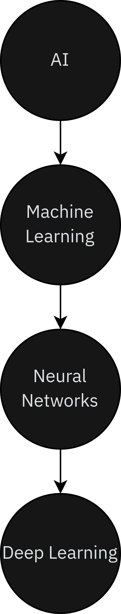

[comment]: # (THEME = white)
[comment]: # (CODE_THEME = base16/zenburn)
[comment]: # (controls: true)
[comment]: # (keyboard: true)
[comment]: # (markdown: { smartypants: true })
[comment]: # (hash: false)
[comment]: # (respondToHashChanges: false)
[comment]: # (Other settings are documented at https://revealjs.com/config/)

# Knowledge Engineering and Extraction 
Yannick Hutter | FHGR Chur | 

[comment]: # (!!!)

## Artificial Intelligence

 <!-- .element: style="height: 40vh;" -->
[comment]: # (!!!)

### Programmierung
* Zu Beginn war das einfach `Programmieren`. Ein Programmierer schrieb ein Programm, welches mithilfe von Inputdaten (Parameter etc.) einen bestimmten Output (Ergebnis) erzeugte. So wurde für **jede Aufgabenstellung ein bestimmtes Programm** geschrieben.

[comment]: # (!!!)

### Machine Learning
* Machine Learning ist der nächste Schritt. Hierzu werden die entsprechenden Parameter (Features) von einer Person extrahiert und anschliessend einem **Modell** zur Verfügung gestellt, welches den gewünschten Output aufgrund von **bestehenden Daten**  vorhersagt.

[comment]: # (!!!)

### Deep Learning
* Deep Learning ist die nächste Evolution. Features werden direkt in das Netz gegeben, dieses zieht automatisch die relevanten Features raus und produziert den gewünschten Output. Deshalb ist hier **keine Unterstützung des Menschen notwendig**.

[comment]: # (!!!)

### Anwendungsfelder
* Vorhersage von **chemischen Reaktionen**
* Bildergenerierung von berühmten Personen

[comment]: # (!!!)

### Nachteile 
* Die Modelle beinhalten immer einen gewissen **Bias**
* Das Verhalten ist **stark abhängig vom Trainingsdatensatz** und kann zu ungewünschtem Verhalten führen (ethisch nicht korrekt etc.)
* Bei Bildererkennung kann das verändern eines einzelnen Pixels zu komplett falschen Resultaten führen.

[comment]: # (!!!)

## Semantisches Web
* Entspricht einer **Erweiterung des derzeitigen Webs**
* Strukturiert bestehende Webressourcen, d.h. für Menschen und Maschinen verstehbar

[comment]: # (!!!)

### Syntax vs. Semantik
* Syntax beschreibt die **Struktur der Daten** (XML, RDF)
* Semantik beschreibt die **Bedeutung der Daten** (RDFS, OWL)

Sind Voraussetzung für **Interoperabilität**, d.h. gemeinsame Syntax (Grammatik) und gemeinsames Verständnis (Ontologie)

[comment]: # (!!!)

### Anwendungsgebiete von semantischen Technologien
* Information Retrieval, d.h. Suchen in unstrukturierten Daten basierend auf Schlüsselwörtern (Google, Page Ranking etc.)
* Semantische Suche - versehen Ressourcen mit semantischen Informationen, dadurch hat die semantische Suche im Gegensatz zur heuristischen/statischen Suche ein bestehendes Hintergrundwissen

[comment]: # (!!!)

### Anwendungsgebiete von semantischen Technologien
* **Verbesserter Datenaustausch** mithilfe von Microformats und RDFa
* Erlaubt Kombination von komplexen Datenquellen durch Linked Open Data und öffentlich zugängliche Ontologie
* Nutzung von verschiedenen Services (Google Maps, Internet of Things etc.)
* **Delegation von komplexen Aufgaben an Agenten** (Buchungen von Reisen etc.)

[comment]: # (!!!)

### Semantic Web Stack

 <!-- .element: style="height: 40vh;" -->
[comment]: # (!!!)

### Semantic Web Stack - ASCII
* Ist ein Zeichensatz, bei welchem Zeichen als Bitfolgen repräsentiert werden.
* Umfasst ingesamt 256 Zeichen (1 Byte)
* Jedoch sind nur 128 Zeichen genutzt
* Es gibt viele verschiedene Encodings um andere Sprachen und Zeichen zu unterstützen
* Abhängig vom jeweiligen Betriebssystem und nicht standardkonform

[comment]: # (!!!)

### Semantic Web Stack - Unicode
* Nachfolger von ASCII
* Platz für 1'114'112 Zeichen unterteilt in 17 Ebenen mit jeweils 216 Zeichen
* UTF-32 hat eine fixe grösse
* UTF-8 und UTF-16 sind variable

[comment]: # (!!!)

### Semantic Web Stack - Ressource Identifier
* Weisst Ressourcen **eindeutige Namen** zu
* Geben an **wo diese Ressourcen gefunden** werden können
* IRI (International Ressource Identifier) - Unicode Zeichenunterstützung
* URI (Uniform Ressource Identifier) - ASCII Zeichenunterstützung
* Identitätsbezeichner URN (Uniform Ressource Name), bspw. ISBN, DOI etc.

[comment]: # (!!!)

### Semantic Web Stack - Ressource Identifier
* URL (Uniform Ressource Locator) - Methode im Web um auf eine Ressource zugreifen zu können
* Pfad kann sich ändern
* Aufbau `schema:location`, d.h. `https://www.google.ch`

[comment]: # (!!!)

### XML (Extensible Markup Language)
* Wird für die Strukturierung von Daten verwendet
* Das zugrundelegende Datenmodell ist eine **Baumstruktur**
* Grundlage für viele weitere Standards (XHTML, RDF/XML etc.)
* Ist eine **syntaktisch standardisierte Metasprache**
* **Keine Interoperabilität**, d.h. funktioniert nur wenn sich alle Akteure auf eine konkrete XML-Syntax festlegen

[comment]: # (!!!)

### XML Namensräume
* Machen ein XML Element durch die Kombination von Namespace URL und Name eindeutig
* Können sowohl von **Anwendern** als auch **Standardisierungsgremien** definiert werden.

[comment]: # (!!!)

## RDF (Ressource Description Framework)
* Ist ein **graphbasiertes Datenmodell** mit dem Format `subject - predicate - object`
* Durch **Kombination von verschiedenen Statements** können komplexe Domänemodelle erstellt werden
* Verschiedene Serialisierungsformate (Turtle, Graphs, XML/RDF)
* **Subject und Predicate** sind **immer Ressourcen**
* **Object** ist entweder eine **Ressource oder ein Literal**

[comment]: # (!!!)

## Linked Open Data
* Öffentlich verfügbare und verlinkte Daten 
* Nutzung von **HTTP URI** damit Personen Zugriff darauf haben
* Sinvolle Informationen beim Zugriff darstellen (mithilfe von RDF, SPARQL)
* Verweise auf andere URI's anbringen

[comment]: # (!!!)

## Qualitätsbewertung
* Daten sind in **irgendeiner Form** vorhanden - 1 Stern
* Daten sind in **strukturierter und editierbarer Form** vorhanden - 2 Sterne
* Daten sind in **einem öffentlichen Format** vorhanden - 3 Sterne
* Daten folgen dem **W3C** Standard (RDF, URI) - 4 Sterne
* Verlinkung **auf andere Ressourcen** - 5 Sterne

[comment]: # (!!!)

## Soziale Graphen (foaf)
* Friend of a Friend (foaf) beschreibt soziale Netwerke
* Unterstützt von Services wie Google Social Graph API, Yahoo etc.

[comment]: # (!!!)

## Relationship
* Spezialisiert um Beziehungen zwischen Personen 
* acquaintanceOf, ambivalentOf etc.

[comment]: # (!!!)

## Dublin Core
* Sammlung von Begrifflichkeiten aus verschiedensten Bereichen
* Audience, Rights, Coverage, Relation, Language, Source, Identifier, Title, Creator, Subject, Description, Publisher, Contributor, Date, Type, Format

[comment]: # (!!!)

## Semantically-Interlinked Online Communities (SIOC)
* Beschreibt interkonntektive Kommunikation über verschiedene Medien (Blogs, Forums, Mailing List) hinweg

[comment]: # (!!!)

## Simple Knowledge Organization Systems (SKOS)
* Beinhaltet Vokabular von Thesauri, Taxonomien etc.

[comment]: # (!!!)

