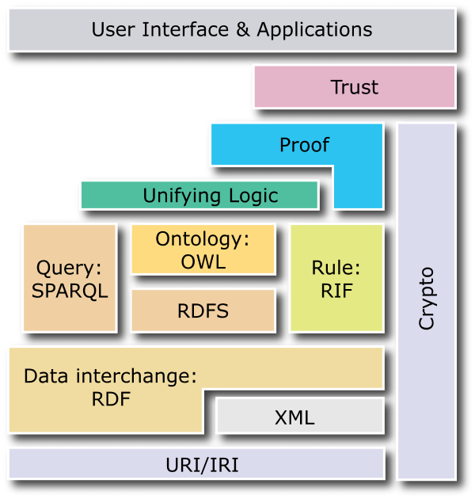

[comment]: # (THEME = black)
[comment]: # (CODE_THEME = monokai)
[comment]: # (controls: true)
[comment]: # (keyboard: true)
[comment]: # (markdown: { smartypants: true })
[comment]: # (hash: false)
[comment]: # (respondToHashChanges: false)
[comment]: # (Other settings are documented at https://revealjs.com/config/)


# Knowledge Engineering and Extraction 
Yannick Hutter | FHGR Chur | 

[comment]: # (!!!)


## Artificial Intelligence

 <!-- .element: style="height: 40vh;" -->
[comment]: # (!!!)

### Programmierung
Zu Beginn war das einfach `Programmieren`. Ein Programmierer schrieb ein Programm, welches mithilfe von Inputdaten (Parameter etc.) einen bestimmten Output (Ergebnis) erzeugte. So wurde für **jede Aufgabenstellung ein bestimmtes Programm** geschrieben.

[comment]: # (!!!)

### Machine Learning
Machine Learning ist der nächste Schritt. Hierzu werden die entsprechenden Parameter (Features) von einer Person extrahiert und anschliessend einem **Modell** zur Verfügung gestellt, welches den gewünschten Output aufgrund von **bestehenden Daten**  vorhersagt.


[comment]: # (!!!)

### Deep Learning
Deep Learning ist die nächste Evolution. Features werden direkt in das Netz gegeben, dieses zieht automatisch die relevanten Features raus und produziert den gewünschten Output. Deshalb ist hier **keine Unterstützung des Menschen notwendig**.

[comment]: # (!!!)

### Anwendungsfelder
* Vorhersage von **chemischen Reaktionen**
* Bildergenerierung von berühmten Personen

[comment]: # (!!!)

### Nachteile 
* Die Modelle beinhalten immer einen gewissen **Bias**
* Das Verhalten ist **stark abhängig vom Trainingsdatensatz** und kann zu ungewünschtem Verhalten führen (ethisch nicht korrekt etc.)
* Bei Bildererkennung kann das verändern eines einzelnen Pixels zu komplett falschen Resultaten führen.

[comment]: # (!!!)


## Semantisches Web
* Entspricht einer **Erweiterung des derzeitigen Webs**
* Strukturiert bestehende Webressourcen, d.h. für Menschen und Maschinen verstehbar

[comment]: # (!!!)

### Syntax vs. Semantik
* Syntax beschreibt die **Struktur der Daten** (XML, RDF)
* Semantik beschreibt die **Bedeutung der Daten** (RDFS, OWL)
* Sind Voraussetzung für **Interoperabilität**, d.h. gemeinsame Syntax (Grammatik) und gemeinsames Verständnis (Ontologie)

[comment]: # (!!!)


### Anwendungsgebiete von semantischen Technologien
* Information Retrieval, d.h. Suchen in unstrukturierten Daten basierend auf Schlüsselwörtern (Google, Page Ranking etc.)
* Semantische Suche - versehen Ressourcen mit semantischen Informationen, dadurch hat die semantische Suche im Gegensatz zur heuristischen/statischen Suche ein bestehendes Hintergrundwissen

[comment]: # (!!!)

### Anwendungsgebiete von semantischen Technologien
* **Verbesserter Datenaustausch** mithilfe von Microformats und RDFa
* Erlaubt Kombination von komplexen Datenquellen durch Linked Open Data und öffentlich zugängliche Ontologie
* Nutzung von verschiedenen Services (Google Maps, Internet of Things etc.)
* **Delegation von komplexen Aufgaben an Agenten** (Buchungen von Reisen etc.)

[comment]: # (!!!)

### Semantic Web Stack

 <!-- .element: style="height: 40vh;" -->
[comment]: # (!!!)


### Semantic Web Stack - ASCII
* Ist ein Zeichensatz, bei welchem Zeichen als Bitfolgen repräsentiert werden.
* Umfasst ingesamt 256 Zeichen (1 Byte)
* Jedoch sind nur 128 Zeichen genutzt
* Es gibt viele verschiedene Encodings um andere Sprachen und Zeichen zu unterstützen
* Abhängig vom jeweiligen Betriebssystem und nicht standardkonform

[comment]: # (!!!)

### Semantic Web Stack - Unicode
* Nachfolger von ASCII
* Platz für 1'114'112 Zeichen unterteilt in 17 Ebenen mit jeweils 216 Zeichen
* UTF-32 hat eine fixe grösse
* UTF-8 und UTF-16 sind variable

[comment]: # (!!!)

### Semantic Web Stack - Ressource Identifier
* Weisst Ressourcen **eindeutige Namen** zu
* Geben an **wo diese Ressourcen gefunden** werden können
* IRI (International Ressource Identifier) - Unicode Zeichenunterstützung
* URI (Uniform Ressource Identifier) - ASCII Zeichenunterstützung
* Identitätsbezeichner URN (Uniform Ressource Name), bspw. ISBN, DOI etc.

[comment]: # (!!!)

### Semantic Web Stack - Ressource Identifier
* URL (Uniform Ressource Locator) - Methode im Web um auf eine Ressource zugreifen zu können
* Pfad kann sich ändern
* Aufbau `schema:location`, d.h. `https://www.google.ch`

[comment]: # (!!!)


### XML (Extensible Markup Language)
* Wird für die Strukturierung von Daten verwendet
* Das zugrundelegende Datenmodell ist eine **Baumstruktur**
* Grundlage für viele weitere Standards (XHTML, RDF/XML etc.)
* Ist eine **syntaktisch standardisierte Metasprache**
* **Keine Interoperabilität**, d.h. funktioniert nur wenn sich alle Akteure auf eine konkrete XML-Syntax festlegen

[comment]: # (!!!)

### XML Namensräume
* Machen ein XML Element durch die Kombination von Namespace URL und Name eindeutig
* Können sowohl von **Anwendern** als auch **Standardisierungsgremien** definiert werden.

[comment]: # (!!!)


## RDF (Ressource Description Framework)
* Ist ein **graphbasiertes Datenmodell** mit dem Format `subject - predicate - object`
* Durch **Kombination von verschiedenen Statements** können komplexe Domänemodelle erstellt werden
* Verschiedene Serialisierungsformate (Turtle, Graphs, XML/RDF)
* **Subject und Predicate** sind **immer Ressourcen**
* **Object** ist entweder eine **Ressource oder ein Literal**

[comment]: # (!!!)

## Linked Open Data
* Öffentlich verfügbare und verlinkte Daten 
* Nutzung von **HTTP URI** damit Personen Zugriff darauf haben
* Sinvolle Informationen beim Zugriff darstellen (mithilfe von RDF, SPARQL)
* Verweise auf andere URI's anbringen

[comment]: # (!!!)

## Qualitätsbewertung
* Daten sind in **irgendeiner Form** vorhanden - 1 Stern
* Daten sind in **strukturierter und editierbarer Form** vorhanden - 2 Sterne
* Daten sind in **einem öffentlichen Format** vorhanden - 3 Sterne
* Daten folgen dem **W3C** Standard (RDF, URI) - 4 Sterne
* Verlinkung **auf andere Ressourcen** - 5 Sterne

[comment]: # (!!!)

## Soziale Graphen (foaf)
* Friend of a Friend (foaf) beschreibt soziale Netwerke
* Unterstützt von Services wie Google Social Graph API, Yahoo etc.

[comment]: # (!!!)

## Relationship
* Spezialisiert um Beziehungen zwischen Personen 
* acquaintanceOf, ambivalentOf etc.

[comment]: # (!!!)

## Dublin Core
* Sammlung von Begrifflichkeiten aus verschiedensten Bereichen
* Audience, Rights, Coverage, Relation, Language, Source, Identifier, Title, Creator, Subject, Description, Publisher, Contributor, Date, Type, Format

[comment]: # (!!!)

## Semantically-Interlinked Online Communities (SIOC)
* Beschreibt interkonntektive Kommunikation über verschiedene Medien (Blogs, Forums, Mailing List) hinweg

[comment]: # (!!!)

## Simple Knowledge Organization Systems (SKOS)
* Beinhaltet Vokabular von Thesauri, Taxonomien etc.

[comment]: # (!!!)

## Homework RDF

[comment]: # (!!!)

### Darstellung von Metadaten
 

[comment]: # (!!!)

### Darstellung von Metadaten als RDF Graph
 

[comment]: # (!!!)

### Darstellung von Metadaten im Turtle Format
```turtle
@base <http://test.org/doc/>.
@prefix default: <http://text.org/uebung#>.
@prefix rdf: <http://www.w3.org/1999/02/22-rdf-syntax-ns#>.
@prefix dc: <http://purl.org/dc/elements/1.1/#>.
@prefix foaf: <http://xmlns.com/foaf/0.1/>.
@prefix ex: <http://example.com/knowledge/>.
@prefix xsd: <http://www.w3.org/2001/XMLSchema#>.

<Klaus_Ita> dc:creator <http://www.wu.ac.at>;
            a          <Person>;
            dc:name    "Klaus Ita".

<http://www.wu.ac.at> dc:date "2012-05-17"^^xsd:date;
               dc:relation <http://www.htwchur.ch>, <http://www.kmi.turgaz.at>.

<http://www.kmi.turgaz.at> dc:title "KMI".

<Ralf_Steuer> dc:creator <http://www.htwchur.ch>;
              a          <Person>;
              dc:name    "Ralf Steuer";
              foaf:knows <Klaus_Ita>.
```
[comment]: # (!!!)

### Anonyme Ressourcen
 

[comment]: # (!!!)

### Anonyme Ressourcen als RDF Graph


[comment]: # (!!!)

### Annotation
 

[comment]: # (!!!)

### Annotation als RDF Graph
 
[comment]: # (!!!)

### Annotation im Turtle Format 
```turtle
@base <http://test.org/doc/>.
@prefix default: <http://text.org/uebung#>.
@prefix rdf: <http://www.w3.org/1999/02/22-rdf-syntax-ns#>.
@prefix dc: <http://purl.org/dc/elements/1.1/#>.
@prefix foaf: <http://xmlns.com/foaf/0.1/>.
@prefix ex: <http://example.com/knowledge/>.
@prefix xsd: <http://www.w3.org/2001/XMLSchema#>.

<http://www.gocomics.com/calvinandhobbes> default:tag "Comic";
                                          default:tag "cute". 
```
[comment]: # (!!!)

### Reification
 

[comment]: # (!!!)

### Reification als RDF Graph
 <!-- .element: style="height: 40vh;" -->

[comment]: # (!!!)

### Fragen Reification als RDF Graph
* Gibt es eine Möglichkeit um ein "wahres" Statement zu kennzeichnen?
* Ist es erlaubt eine bestehende Ressource aus Gründen der Übersichtlichkeit zu duplizieren, bei vielen Statements welche auf die gleichen Ressourcen verweisen könnte das unübersichtlich werden
[comment]: # (!!!)

### Serialisierungsformate
 

[comment]: # (!!!)

### Serialisierungsformate als RDF Graph
 

[comment]: # (!!!)

### Vertiefungsbeispiel GDP
 

[comment]: # (!!!)

### Vertiefungsbeispiel GDP als RDF Graph
 <!-- .element: style="height: 40vh;" -->

[comment]: # (!!!)

### Vertiefungsbeispiel GDP im Turtle Format 
```turtle
@base <http://text.org/>.
@prefix default: <http://text.org/uebung#>.
@prefix dpo: <https://dbpedia.org/>.
@prefix xsd: <http://www.w3.org/2001/XMLSchema#>.
@prefix dc: <http://purl.org/dc/elements/1.1/#/>.

<United_States> default:rank "1"^^xsd:nonNegativeInteger;
                dc:name      "United States";
                default:gdpPerCapita "66301.5850"^^xsd:double;
                default:imfGDP       "22198120000000"^^xsd:double;
                default:unGDP        "18624475000000"^^xsd:double;
                dpo:populationTotal  "334805.2690"^^xsd:double.
...
```
[comment]: # (!!!)

### Vertiefungsbeispiel GDP als Code
```python
import os.path
import gzip
import csv

"""
Reads a csv gz compressed file about Country rankings in regards to their gdp values and writes out
a Turtle conform file which can be imported into SPAQRQL Triplestore.
Implemented with reference to:
    - https://docs.python.org/3/library/gzip.html#gzip.GzipFile
    - https://docs.python.org/3/library/csv.html#csv.reader
"""


def add_namespaces(content):
    content.append("@base <http://text.org/>.")
    content.append("@prefix default: <http://text.org/uebung#>.")
    content.append("@prefix dpo: <https://dbpedia.org/>.")
    content.append("@prefix xsd: <http://www.w3.org/2001/XMLSchema#>.")
    content.append("@prefix dc: <http://purl.org/dc/elements/1.1/#/>.")

    return content

if __name__ == "__main__":
    input_file_path = "./vertiefungsbeispiel-gdp.csv.gz"
    output_file_path = "./output.ttl"

    # Check if expected input file was provided...
    if not os.path.isfile(input_file_path):
       print(f"Expected to find file {input_file_path} but it was not found") 
       exit()
    
    # Note that we need to read this file in 'text mode' therefore 'rt'
    with gzip.open(input_file_path, "rt") as f:
        csv_reader = csv.reader(f)

        # Add required namespaces...
        output_content = []
        output_content = add_namespaces(output_content)

        # Advance the iterator once so we skip the first row which contains the headers
        next(csv_reader)

        # Note that the order must be the same as the headers in the csv file...
        for rank, country, imf_gdp, un_gdp, gdp_per_capita, pop in csv_reader:
            # Convert e.g "United States" into "United_States"
            row_subject = country.strip().replace(' ', '_').replace('-', '_')

            # Add necessary statements...
            rank_statement = f'<{row_subject}> default:rank "{rank}"^^xsd:nonNegativeInteger.' 
            name_statement = f'<{row_subject}> dc:name "{country}".'
            gdp_per_capita_statement = f'<{row_subject}> default:gdpPerCapita "{gdp_per_capita}"^^xsd:double.' 
            imf_gdp_statement = f'<{row_subject}> default:imfGDP "{imf_gdp}"^^xsd:double.' 
            un_gdp_statement = f'<{row_subject}> default:unGDP "{un_gdp}"^^xsd:double.' 
            population_statement = f'<{row_subject}> dpo:populationTotal "{pop}"^^xsd:nonNegativeInteger.' 

            output_content += [rank_statement, name_statement, gdp_per_capita_statement, imf_gdp_statement, un_gdp_statement, population_statement]

        with open(output_file_path, "w") as f:
            for line in output_content:
                f.write(f"{line}\n")
        print(f"Finished converting {input_file_path} to {output_file_path}")
```
[comment]: # (!!!)
### Fragen Vertiefungsbeispiel GDP
* Was passiert wenn bei einer Ressource Attribute vorhanden sind, bei einer andere aber nicht? Bswp. `populationTotal` bei [Turks and Caicos Island](https://dbpedia.org/page/Turks_and_Caicos_Islands) und [United States](https://dbpedia.org/page/United_States).
* Wie findet man den `dpo` Namespace heraus von bspw. [populationTotal](https://dbpedia.org/ontology/populationTotal)?
[comment]: # (!!!)
